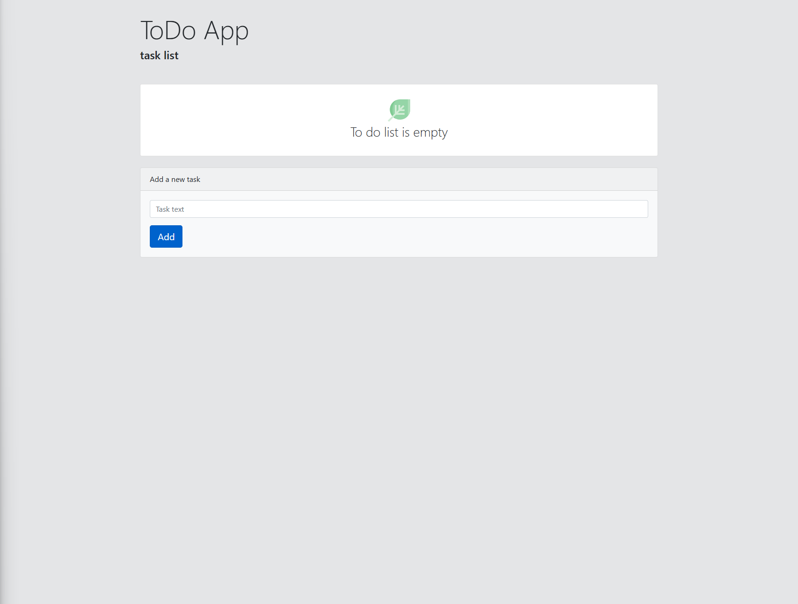
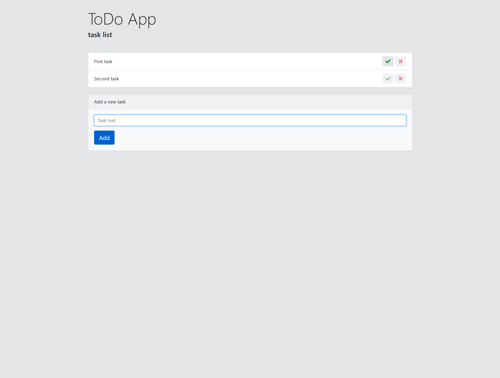

# ToDo App 

A simple task management app built with HTML, CSS, JavaScript, and Bootstrap. Tasks are stored in the browser’s local storage, so they remain saved even after closing the tab.

## Live Demo

[Visit the site](https://todo-xdae.onrender.com/)

##  Tech Stack

- **HTML**
- **CSS**
- **JavaScript**
- **Bootstrap**
- **LocalStorage** for data persistence

## Features

- Add and delete tasks
- Mark tasks as completed
- All tasks are saved in the browser using localStorage
- Fully responsive design with Bootstrap

## Screenshots

### Main Page

### Tasks

## 👤 Author

**Dmitriy Batrakov**  
[GitHub Profile](https://github.com/your-username)
